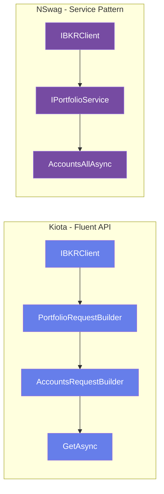
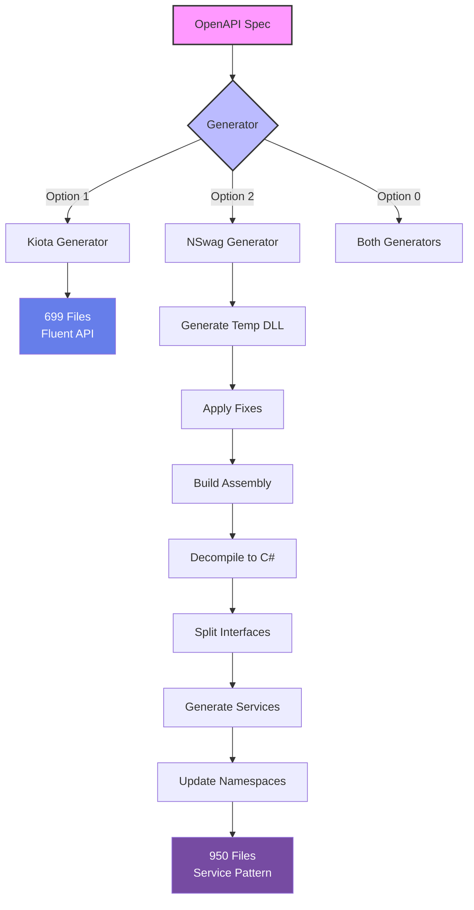

# IBKR API Client Generator

[](https://dotnet.microsoft.com/)
[](LICENSE)
[](https://swagger.io/specification/)

> **Dual SDK Generator for Interactive Brokers API** - Generate production-ready C# clients using Microsoft Kiota or NSwag from the official IBKR OpenAPI specification.

## 📋 Table of Contents

- [Overview](#overview)
- [Features](#features)
- [Quick Start](#quick-start)
- [SDK Comparison](#sdk-comparison)
- [Project Structure](#project-structure)
- [Usage Examples](#usage-examples)
- [Architecture](#architecture)
- [Contributing](#contributing)

## 🎯 Overview

This project provides a complete code generation pipeline for the Interactive Brokers API, offering **two production-ready SDK implementations**:

| SDK | Pattern | Files | Best For |
|-----|---------|-------|----------|
| **[Kiota](src/IBKR.Api.V2.Generated.Kiota/)** | Fluent RequestBuilder | 699 | Modern apps, middleware pipelines |
| **[NSwag](src/IBKR.Api.V2.Generated.NSwag/)** | Service-oriented | 950 | Traditional .NET, minimal deps |

Both SDKs:
- ✅ Generated from the same OpenAPI v3 spec
- ✅ Cover all 14 IBKR API service domains
- ✅ Support ~140 API endpoints
- ✅ Are fully async with cancellation token support
- ✅ Include comprehensive error handling
- ✅ Target .NET 8.0 with nullable reference types

> [!TIP]
> **Not sure which SDK to choose?** See our [detailed comparison guide](SDK-COMPARISON.md) with architecture diagrams, code examples, and decision matrices.

## ✨ Features

### 🔄 Idempotent Generation
- One-click regeneration of both SDKs
- Automatically fixes known OpenAPI spec issues
- Organizes NSwag output into clean service architecture
- Uses temporary build directories (auto-cleaned)

### 🏗️ Advanced Code Organization
The NSwag SDK is automatically reorganized from a monolithic 48K-line file into:
- **14 Service Classes** - Logical domain separation
- **14 Interface Definitions** - DI-ready contracts
- **906 Model Classes** - Complete type coverage
- **Proper Namespacing** - Matches folder structure

### 🛠️ Built-in Tooling
- **OpenAPI Analysis** - Validate and inspect the spec
- **Automated Fixing** - Corrects TradingInstrument2 phantom references
- **Namespace Updates** - Ensures proper using directives
- **Interface Splitting** - Extracts service interfaces
- **Decompilation** - Converts assemblies back to organized source

## 🚀 Quick Start

### Prerequisites

- [.NET 8.0 SDK](https://dotnet.microsoft.com/download/dotnet/8.0)
- Windows, macOS, or Linux

### Generate Both SDKs

```bash
cd src/IBKR.Api.V2.Generator
dotnet run
# Select option 0 for both SDKs
```

### Generate Specific SDK

```bash
# Option 1: Kiota only
# Option 2: NSwag only
# Option 3: Analyze OpenAPI spec
```

### Use the Generated SDKs

<details>
<summary><b>Kiota SDK Usage</b></summary>

```csharp
using IBKR.Api.V2.Generated.Kiota;
using Microsoft.Kiota.Abstractions.Authentication;
using Microsoft.Kiota.Http.HttpClientLibrary;

// Setup
var authProvider = new AnonymousAuthenticationProvider();
var adapter = new HttpClientRequestAdapter(authProvider);
var client = new IBKRClient(adapter);

// Fluent API - Get accounts
var accounts = await client.Portfolio.Accounts.GetAsync();

// Get positions for specific account
var positions = await client.Portfolio["DU123456"]
    .Positions["0"]
    .GetAsync();
```

</details>

<details>
<summary><b>NSwag SDK Usage</b></summary>

```csharp
using IBKR.Api.V2.Generated.NSwag.Services;
using IBKR.Api.V2.Generated.NSwag.Interfaces;

// Setup
var httpClient = new HttpClient
{
    BaseAddress = new Uri("https://api.ibkr.com")
};
var client = new IBKRClient(httpClient);

// Service-based API - Get accounts
var accounts = await client.Portfolio.AccountsAllAsync();

// Get positions for specific account
var positions = await client.Portfolio.PositionsAllAsync("DU123456");
```

</details>

## 📊 SDK Comparison

Both SDKs provide identical API coverage but with different architectural approaches:

### Architecture Patterns



### Quick Comparison

| Feature | Kiota | NSwag |
|---------|-------|-------|
| **Learning Curve** | Moderate | Easy |
| **Dependencies** | Kiota.Bundle (2.5MB) | Newtonsoft.Json (600KB) |
| **API Discovery** | Excellent (fluent) | Good (interfaces) |
| **DI Support** | RequestAdapter | HttpClient + Interfaces |
| **Middleware** | Built-in pipeline | Via HttpClient handlers |
| **Best For** | New projects, microservices | Legacy codebases, simple APIs |

> [!NOTE]
> **For a comprehensive analysis**, including code examples, pros/cons, decision matrices, and performance comparisons, see **[SDK-COMPARISON.md](SDK-COMPARISON.md)**.

## 📁 Project Structure

```
ibkr/
├── src/
│   ├── IBKR.Api.V2.Generator/              # Code generation engine
│   │   ├── Program.cs                       # Main entry point
│   │   ├── NSwagReorganization/             # NSwag reorganizer
│   │   │   ├── NSwagReorganizer.cs          # Orchestration
│   │   │   ├── InterfaceSplitter.cs         # Extract interfaces
│   │   │   ├── ServiceImplementationGenerator.cs
│   │   │   └── NamespaceUpdater.cs          # Fix namespaces
│   │   └── NSwagProjectFixer.cs             # Fix spec issues
│   │
│   ├── IBKR.Api.V2.Generated.Kiota/         # Kiota SDK (699 files)
│   │   ├── IBKRClient.cs                    # Main client
│   │   ├── Models/                          # 417 model classes
│   │   ├── Portfolio/                       # Portfolio service
│   │   ├── Iserver/                         # Trading server
│   │   └── [12 more service folders]
│   │
│   └── IBKR.Api.V2.Generated.NSwag/         # NSwag SDK (950 files)
│       ├── Services/                        # 15 service classes
│       │   ├── IBKRClient.cs                # Composite client
│       │   ├── PortfolioService.cs
│       │   └── [13 more services]
│       ├── Interfaces/                      # 15 interfaces
│       │   ├── IIBKRClient.cs
│       │   └── IPortfolioService.cs
│       ├── Models/                          # 906 model classes
│       ├── Clients/                         # 8 helper classes
│       └── Helpers/                         # 3 utilities
│
├── bin/temp/                                # Temp build artifacts (auto-cleaned)
├── SDK-COMPARISON.md                        # Detailed SDK analysis
└── README.md                                # This file
```

## 💻 Usage Examples

### Dependency Injection Setup

<details>
<summary><b>Kiota with DI</b></summary>

```csharp
// Startup.cs or Program.cs
services.AddSingleton<IAuthenticationProvider>(sp =>
    new AnonymousAuthenticationProvider());

services.AddSingleton<IRequestAdapter>(sp =>
{
    var authProvider = sp.GetRequiredService<IAuthenticationProvider>();
    return new HttpClientRequestAdapter(authProvider);
});

services.AddSingleton<IBKRClient>();

// Usage in your service
public class TradingService
{
    private readonly IBKRClient _ibkrClient;

    public TradingService(IBKRClient ibkrClient)
    {
        _ibkrClient = ibkrClient;
    }

    public async Task<List<AccountAttributes>> GetAccountsAsync()
    {
        return await _ibkrClient.Portfolio.Accounts.GetAsync();
    }
}
```

</details>

<details>
<summary><b>NSwag with DI</b></summary>

```csharp
// Startup.cs or Program.cs
services.AddHttpClient<IIBKRClient, IBKRClient>(client =>
{
    client.BaseAddress = new Uri("https://api.ibkr.com");
    // Add authentication headers
});

// Or register individual services
services.AddHttpClient<IPortfolioService, PortfolioService>(client =>
{
    client.BaseAddress = new Uri("https://api.ibkr.com");
});

// Usage in your service
public class TradingService
{
    private readonly IIBKRClient _ibkrClient;

    public TradingService(IIBKRClient ibkrClient)
    {
        _ibkrClient = ibkrClient;
    }

    public async Task<ICollection<AccountAttributes>> GetAccountsAsync()
    {
        return await _ibkrClient.Portfolio.AccountsAllAsync();
    }
}
```

</details>

### API Coverage - 14 Service Domains

Both SDKs provide complete coverage of:

| Service | Purpose | Example Endpoints |
|---------|---------|-------------------|
| 🔐 **Acesws** | Authentication & Websocket | `/acesws` |
| 📰 **Fyi** | Notifications & Alerts | `/fyi/notifications`, `/fyi/settings` |
| 🌐 **Gw** | Gateway Management | `/gw/api/v1/*` |
| 📊 **Hmds** | Historical Market Data | `/hmds/history` |
| ⚡ **Iserver** | Interactive Server (Trading) | `/iserver/account`, `/iserver/contract` |
| 🚪 **Logout** | Session Termination | `/logout` |
| 💹 **Md** | Market Data Snapshots | `/md/snapshot` |
| 🔑 **OAuth** | OAuth 2.0 Integration | `/oauth/authorize`, `/oauth/token` |
| 📈 **Pa** | Performance Analytics | `/pa/performance`, `/pa/summary` |
| 💼 **Portfolio** | Account & Position Data | `/portfolio/accounts`, `/portfolio/positions` |
| 🔐 **Sso** | Single Sign-On | `/sso/validate` |
| ⏱️ **Tickle** | Keep-Alive | `/tickle` |
| 📡 **Trsrv** | Transaction Server | `/trsrv/*` |
| 🔌 **Ws** | WebSocket Endpoints | `/ws` |

## 🏗️ Architecture

### Generation Pipeline



### NSwag Reorganization Process

The NSwag SDK goes through an advanced reorganization:

1. **Generation** - NSwag creates monolithic 48K-line `IBKRClient.cs`
2. **Compilation** - Build to assembly in temp directory
3. **Decompilation** - ICSharpCode.Decompiler extracts organized C# source
4. **Interface Extraction** - 14 service interfaces extracted from monolith
5. **Service Generation** - 14 service implementation classes created
6. **Namespace Fixing** - All files updated with proper namespaces and using directives
7. **Cleanup** - Temp directory removed, final SDK ready

This process transforms:
```
IBKRClient.cs (48,168 lines)
```
Into:
```
Services/
  ├── PortfolioService.cs
  ├── IserverService.cs
  └── [12 more services]
Interfaces/
  ├── IPortfolioService.cs
  └── [13 more interfaces]
Models/
  └── [906 model classes]
```

## 🔧 Advanced Features

### Custom OpenAPI Fixes

The generator automatically fixes known issues in the IBKR OpenAPI spec:

- **TradingInstrument2** phantom reference → replaced with `TradingInstrument`
- **Namespace conflicts** → resolved automatically
- **Type ambiguities** → fully qualified type names

### Regeneration

Both SDKs are **idempotent** - you can safely regenerate them at any time:

```bash
cd src/IBKR.Api.V2.Generator
dotnet run
# Select option 0
```

The generator will:
1. Clean existing SDK directories
2. Regenerate from fresh OpenAPI spec
3. Apply all fixes and transformations
4. Build and validate both SDKs

> [!WARNING]
> Regeneration will **overwrite** any manual changes to generated files. If you need custom modifications, consider using partial classes or wrapper services.

## 📖 Documentation

- **[SDK Comparison Guide](SDK-COMPARISON.md)** - Comprehensive analysis, architecture diagrams, code examples
- **[IBKR API Documentation](https://ibkrcampus.com/ibkr-api-page/cpapi-v1/)** - Official API reference
- **[Kiota Documentation](https://learn.microsoft.com/en-us/openapi/kiota/overview)** - Microsoft Kiota guide
- **[NSwag Documentation](https://github.com/RicoSuter/NSwag)** - NSwag project docs

## 🤝 Contributing

Contributions are welcome! Please feel free to submit issues or pull requests.

### Development Workflow

1. Fork the repository
2. Create a feature branch: `git checkout -b feature/my-feature`
3. Make your changes
4. Test by regenerating SDKs: `dotnet run` in Generator project
5. Commit your changes: `git commit -am 'Add new feature'`
6. Push to the branch: `git push origin feature/my-feature`
7. Submit a pull request

## 📄 License

This project is licensed under the MIT License - see the [LICENSE](LICENSE) file for details.

## 🙏 Acknowledgments

- **Interactive Brokers** for providing the comprehensive OpenAPI specification
- **Microsoft Kiota Team** for the modern code generation framework
- **Rico Suter** for the NSwag toolchain
- **ICSharpCode** for the Decompiler library

---

<div align="center">

**[View SDK Comparison](SDK-COMPARISON.md)** | **[Report Issues](../../issues)** | **[IBKR API Docs](https://ibkrcampus.com/ibkr-api-page/cpapi-v1/)**

Made with ❤️ for .NET developers trading with Interactive Brokers

</div>
