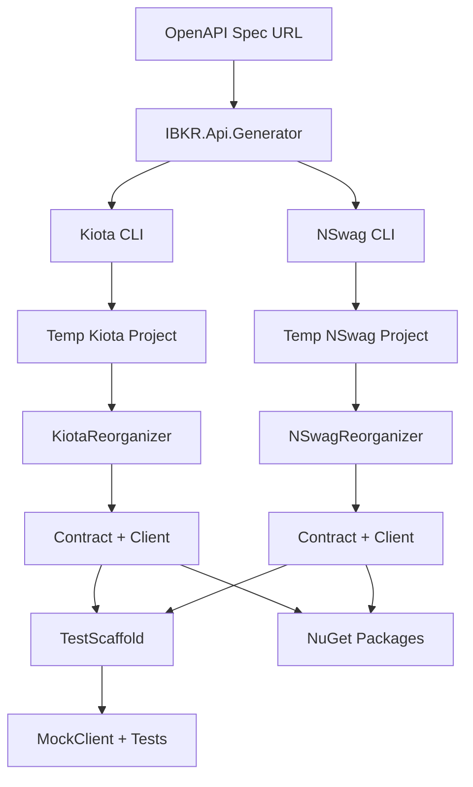

# Architecture Overview

This document explains the repository structure, SDK generation workflow, and design decisions.

## Repository Structure

```
ibkr/
├── .github/
│   └── workflows/
│       └── release.yml          # CI/CD pipeline for releases
│
├── docs/                        # Documentation (you are here)
│   ├── README.md
│   ├── SDK-COMPARISON.md
│   ├── GETTING-STARTED.md
│   ├── NSWAG-SDK.md
│   ├── KIOTA-SDK.md
│   ├── TESTING.md
│   ├── ARCHITECTURE.md
│   ├── CONTRIBUTING.md
│   └── RELEASE-WORKFLOW.md
│
├── src/
│   ├── Directory.Build.props    # Shared NuGet metadata
│   │
│   ├── IBKR.Api.Generator/      # SDK generator
│   │   ├── Program.cs           # Main orchestrator
│   │   ├── KiotaReorganization/
│   │   │   └── KiotaReorganizer.cs
│   │   └── NSwagReorganization/
│   │       └── NSwagReorganizer.cs
│   │
│   ├── IBKR.Api.TestScaffold/   # Test infrastructure generator
│   │   ├── Program.cs
│   │   ├── MockClientScaffolder.cs
│   │   └── TestProjectScaffolder.cs
│   │
│   ├── Kiota/                   # Generated Kiota SDK
│   │   ├── IBKR.Api.Kiota.Contract/
│   │   ├── IBKR.Api.Kiota.Client/
│   │   ├── IBKR.Api.Kiota.MockClient/  # User-editable
│   │   └── IBKR.Api.Kiota.Tests/       # User-editable
│   │
│   └── NSwag/                   # Generated NSwag SDK
│       ├── IBKR.Api.NSwag.Contract/
│       ├── IBKR.Api.NSwag.Client/
│       ├── IBKR.Api.NSwag.MockClient/  # User-editable
│       └── IBKR.Api.NSwag.Tests/       # User-editable
│
├── LICENSE                      # MIT License
└── README.md                    # Project overview
```

## SDK Generation Workflow

### High-Level Pipeline



### Detailed Steps

#### 1. Generator (IBKR.Api.Generator)

**Purpose:** Download OpenAPI spec and invoke code generators

```
Program.cs:
├─ Download OpenAPI spec from api.ibkr.com
├─ Option 0: Generate both SDKs
│   ├─ Option 1: Generate NSwag only
│   └─ Option 2: Generate Kiota only
│
├─ For Kiota:
│   ├─ Create temp project: IBKR.Api.Kiota
│   ├─ Run: kiota generate --openapi spec.json
│   ├─ Build temp project
│   └─ Run: KiotaReorganizer
│
└─ For NSwag:
    ├─ Create temp project: IBKR.Api.NSwag
    ├─ Run: nswag openapi2csclient
    ├─ Build temp project
    └─ Run: NSwagReorganizer
```

#### 2. Reorganization

Both reorganizers split monolithic generated code into 2 projects:

**KiotaReorganizer:**
```
Input:  IBKR.Api.Kiota/ (monolithic)
├─ Models/
├─ RequestBuilders/
└── IBKRClient.cs

Output:
├─ IBKR.Api.Kiota.Contract/
│   └─ Models/          # Moved
│
└─ IBKR.Api.Kiota.Client/
    ├─ RequestBuilders/ # Moved
    └─ IBKRClient.cs    # Moved

Cleanup: Delete temp IBKR.Api.Kiota/
```

**NSwagReorganizer:**
```
Input:  IBKR.Api.NSwag/ (monolithic)
├─ Models/
├─ Services/
└─ Interfaces/

Output:
├─ IBKR.Api.NSwag.Contract/
│   ├─ Models/          # Moved
│   └─ Interfaces/      # Moved
│
└─ IBKR.Api.NSwag.Client/
    └─ Services/        # Moved

Cleanup: Delete temp IBKR.Api.NSwag/
```

#### 3. Test Scaffolding (IBKR.Api.TestScaffold)

**Purpose:** Create test infrastructure (runs separately, preserves existing code)

```
TestScaffold:
├─ For each SDK (NSwag, Kiota):
│   │
│   ├─ MockClientScaffolder:
│   │   ├─ Check if .csproj exists
│   │   ├─ If not: Create MockClient project
│   │   └─ If yes: Skip (preserve user code)
│   │
│   └─ TestProjectScaffolder:
│       ├─ Check if .csproj exists
│       ├─ If not: Create Test project with:
│       │   ├─ TestFixture.cs (DI setup)
│       │   ├─ Example tests
│       │   └─ appsettings.json files
│       └─ If yes: Skip (preserve user code)
│
└─ Add projects to solution
```

## Project Dependencies

### NSwag Architecture

```
┌──────────────────────────────┐
│  IBKR.Api.NSwag.Tests        │
│  (xUnit, DI, Configs)         │
└────────┬────────┬─────────────┘
         │        │
         │        └────────────────────┐
         │                             │
┌────────▼────────────────┐  ┌─────────▼─────────────┐
│  IBKR.Api.NSwag.Client  │  │ IBKR.Api.NSwag.       │
│  (Service Impls)        │  │ MockClient            │
└────────┬────────────────┘  │ (Test Mocks)          │
         │                   └─────────┬───────────────┘
         │                             │
         └────────┬────────────────────┘
                  │
    ┌─────────────▼────────────────┐
    │ IBKR.Api.NSwag.Contract      │
    │ (Models + Interfaces)        │
    └──────────────────────────────┘
```

### Kiota Architecture

```
┌──────────────────────────────┐
│  IBKR.Api.Kiota.Tests        │
│  (xUnit, DI, Configs)         │
└────────┬────────┬─────────────┘
         │        │
         │        └────────────────────┐
         │                             │
┌────────▼────────────────┐  ┌─────────▼─────────────┐
│  IBKR.Api.Kiota.Client  │  │ IBKR.Api.Kiota.       │
│  (Request Builders)     │  │ MockClient            │
└────────┬────────────────┘  │ (IRequestAdapter)     │
         │                   └─────────┬───────────────┘
         │                             │
         └────────┬────────────────────┘
                  │
    ┌─────────────▼────────────────┐
    │ IBKR.Api.Kiota.Contract      │
    │ (Models only)                │
    └──────────────────────────────┘
```

## Design Decisions

### Why Separate Contract & Client?

**Benefits:**
1. **Smaller Dependencies**: Consumers can reference only Contract if they just need models
2. **Versioning**: Contract can be version-stable while Client evolves
3. **Testing**: Easier to mock when interface/models are separate from implementation
4. **Reusability**: Contract can be shared across multiple client implementations

### Why Not Include MockClient in Generator?

**Separation of Concerns:**
- **Generator**: Auto-generated, always overwritten
- **MockClient**: User-editable, preserved across regenerations
- **Tests**: User-editable, preserved across regenerations

This allows developers to:
- Regenerate SDKs without losing mock implementations
- Gradually implement mocks as needed
- Customize test infrastructure

### Why Both NSwag and Kiota?

**Different Use Cases:**
- **NSwag**: Traditional .NET developers, enterprise DI patterns
- **Kiota**: Modern .NET, fluent APIs, Microsoft tooling

Offering both gives users choice without maintaining two separate projects.

## Build Configuration

### Directory.Build.props

Shared properties for all SDK projects:

```xml
<PropertyGroup>
  <Authors>Paul Fryer</Authors>
  <Copyright>Copyright © 2025 IBKR SDK Contributors</Copyright>
  <PackageLicenseExpression>MIT</PackageLicenseExpression>
  <RepositoryUrl>https://github.com/paulfryer/ibkr.git</RepositoryUrl>

  <!-- Source Link Support -->
  <PublishRepositoryUrl>true</PublishRepositoryUrl>
  <EmbedUntrackedSources>true</EmbedUntrackedSources>
  <IncludeSymbols>true</IncludeSymbols>
  <SymbolPackageFormat>snupkg</SymbolPackageFormat>

  <!-- Suppress auto-generated code warnings -->
  <NoWarn>$(NoWarn);CS1591;CS0612;CS8600;CS8603;CS8604;CS8619;CS8625;CS8765</NoWarn>
</PropertyGroup>
```

### Individual Project Descriptions

Each project has its own `<Description>` in `.csproj`:

```xml
<!-- Contract -->
<Description>Contract library containing models and interfaces for the IBKR API</Description>

<!-- Client -->
<Description>Client library for accessing the IBKR REST API</Description>
```

## CI/CD Pipeline

See [RELEASE-WORKFLOW.md](RELEASE-WORKFLOW.md) for detailed workflow documentation.

**High-level pipeline:**

```
GitHub Actions (Manual Trigger):
├─ Input: Version number (semver)
│
├─ Job: Validate version format
│
├─ Job: Generate SDKs
│   ├─ Run IBKR.Api.Generator (option 0)
│   └─ Upload generated code as artifact
│
├─ Job: Scaffold Tests
│   ├─ Run IBKR.Api.TestScaffold
│   └─ Upload complete source
│
├─ Jobs: Build (parallel)
│   ├─ Build NSwag SDK
│   │   ├─ Restore → Build → Pack
│   │   └─ Upload NuGet packages
│   │
│   └─ Build Kiota SDK
│       ├─ Restore → Build → Pack
│       └─ Upload NuGet packages
│
├─ Jobs: Test (parallel)
│   ├─ Test NSwag SDK (with mocks)
│   └─ Test Kiota SDK (with mocks)
│
├─ Job: Create Summary
│   └─ Generate markdown summary
│
└─ Job: Create Release (optional)
    ├─ Create GitHub tag
    ├─ Create GitHub release
    └─ Attach NuGet packages
```

## Technology Stack

| Component | Technology | Version |
|-----------|------------|---------|
| SDK Target | .NET | 8.0 |
| NSwag Generator | NSwag CLI | 14.3+ |
| Kiota Generator | Kiota CLI | 1.19+ |
| Testing Framework | xUnit | 2.9+ |
| DI Container | Microsoft.Extensions.DI | 8.0 |
| CI/CD | GitHub Actions | - |
| Package Format | NuGet | - |

## Performance Characteristics

### Generation Time

| Operation | Time |
|-----------|------|
| Download OpenAPI spec | ~2s |
| Generate NSwag SDK | ~15s |
| Generate Kiota SDK | ~20s |
| Reorganize projects | ~2s |
| Scaffold tests | ~1s |
| **Total (both SDKs)** | **~40s** |

### Package Sizes

| Package | Size |
|---------|------|
| NSwag.Contract | ~200 KB |
| NSwag.Client | ~300 KB |
| Kiota.Contract | ~150 KB |
| Kiota.Client | ~200 KB |

### Runtime Footprint

Both SDKs have minimal runtime overhead:
- Memory: <10 MB for typical usage
- CPU: Negligible (HttpClient is the bottleneck)
- Startup: <50ms additional overhead

## Security Considerations

### OpenAPI Spec Source

- Spec is downloaded from `https://api.ibkr.com`
- HTTPS ensures spec integrity
- Generator fails if download fails

### Generated Code Review

- All generated code is committed to repository
- Pull requests allow code review before merge
- Deterministic generation (same input = same output)

### Dependency Management

- All dependencies are explicitly versioned
- NuGet packages use SemVer
- Renovate/Dependabot can automate updates

## Extensibility

### Custom Transformations

Add custom logic to reorganizers:

```csharp
// KiotaReorganizer.cs
public void Reorganize()
{
    // ... standard reorganization

    // Custom: Add utility classes
    AddUtilityClasses(clientDir);
}
```

### Additional Generators

Create new generator projects following the same pattern:

```
src/
└── IBKR.Api.CustomGenerator/
    ├── Program.cs
    └── CustomReorganizer.cs
```

### Workflow Extensions

Add new jobs to `.github/workflows/release.yml`:

```yaml
custom-validation:
  name: Custom Validation
  needs: [generate-sdks]
  runs-on: ubuntu-latest
  steps:
    - name: Run custom validation
      run: |
        # Your custom logic
```

## Troubleshooting

### Generator Fails

**Check:**
1. OpenAPI spec is accessible
2. NSwag/Kiota CLI is installed
3. Temp project builds successfully

### Reorganization Fails

**Check:**
1. Expected directories exist in temp project
2. No file access errors
3. Solution file is valid

### Tests Fail in CI

**Check:**
1. MockClient implementations are complete
2. `appsettings.test.json` exists
3. Test projects build successfully

## Next Steps

- **[Contributing Guide](CONTRIBUTING.md)** - How to regenerate SDKs
- **[Release Workflow](RELEASE-WORKFLOW.md)** - CI/CD pipeline details

---

**Questions?** Open an issue at https://github.com/paulfryer/ibkr/issues
